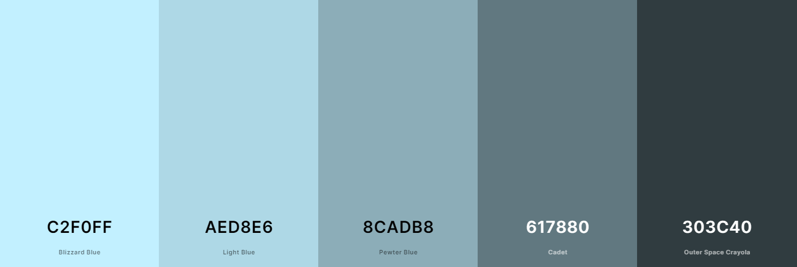
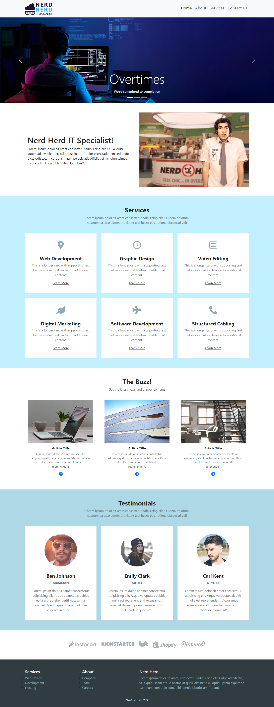
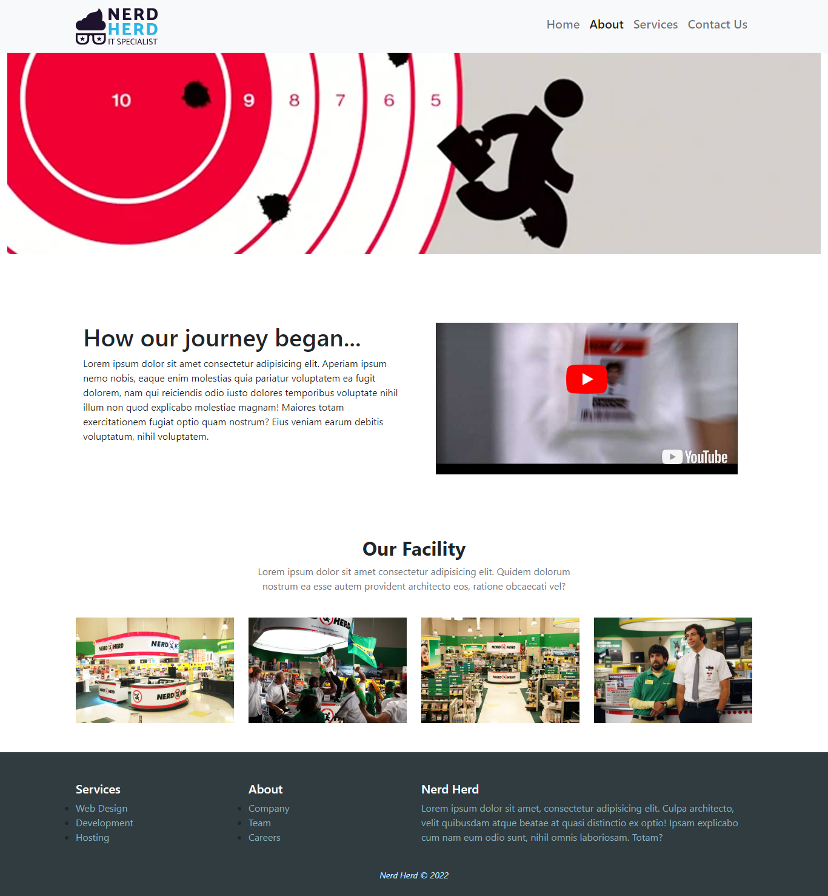
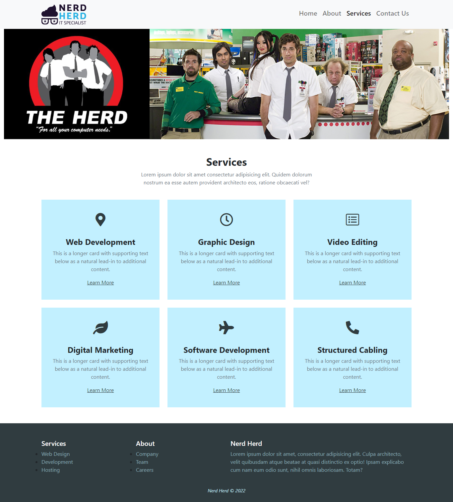
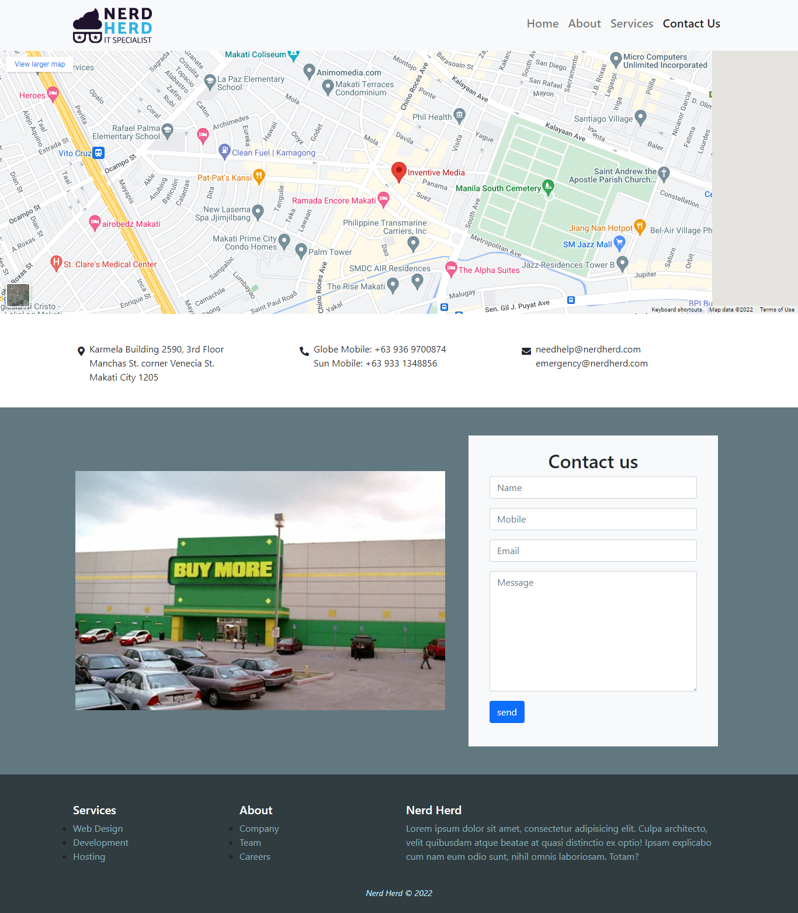

# Front-end Style Guide

## Table of Contents

- [Colors](#colors)
- [Icons](#icons)
- [Layout](#layout)
  - [Home](#home)
  - [About](#about)
  - [Services](#services)
  - [Contact](#contact)
- [Initializing Your Project](#initializing-your-project)

## Colors



- Blizzard Blue: #c2f0ff
- Light Blue: #aed8e6
- Pewter Blue: #8cadb8
- Cadet: #617880
- Outer Space Crayola: #303c40

[Back to Top](#front-end-style-guide)

## Icons

Web Development
```html
<svg xmlns="http://www.w3.org/2000/svg" width="16" height="16" fill="currentColor" class="bi bi-laptop" viewBox="0 0 16 16">
  <path d="M13.5 3a.5.5 0 0 1 .5.5V11H2V3.5a.5.5 0 0 1 .5-.5h11zm-11-1A1.5 1.5 0 0 0 1 3.5V12h14V3.5A1.5 1.5 0 0 0 13.5 2h-11zM0 12.5h16a1.5 1.5 0 0 1-1.5 1.5h-13A1.5 1.5 0 0 1 0 12.5z"/>
</svg>
```

Graphic Design
```html
<svg xmlns="http://www.w3.org/2000/svg" width="16" height="16" fill="currentColor" class="bi bi-palette" viewBox="0 0 16 16">
  <path d="M8 5a1.5 1.5 0 1 0 0-3 1.5 1.5 0 0 0 0 3zm4 3a1.5 1.5 0 1 0 0-3 1.5 1.5 0 0 0 0 3zM5.5 7a1.5 1.5 0 1 1-3 0 1.5 1.5 0 0 1 3 0zm.5 6a1.5 1.5 0 1 0 0-3 1.5 1.5 0 0 0 0 3z"/>
  <path d="M16 8c0 3.15-1.866 2.585-3.567 2.07C11.42 9.763 10.465 9.473 10 10c-.603.683-.475 1.819-.351 2.92C9.826 14.495 9.996 16 8 16a8 8 0 1 1 8-8zm-8 7c.611 0 .654-.171.655-.176.078-.146.124-.464.07-1.119-.014-.168-.037-.37-.061-.591-.052-.464-.112-1.005-.118-1.462-.01-.707.083-1.61.704-2.314.369-.417.845-.578 1.272-.618.404-.038.812.026 1.16.104.343.077.702.186 1.025.284l.028.008c.346.105.658.199.953.266.653.148.904.083.991.024C14.717 9.38 15 9.161 15 8a7 7 0 1 0-7 7z"/>
</svg>
```

Digital Marketing
```html
<svg xmlns="http://www.w3.org/2000/svg" width="16" height="16" fill="currentColor" class="bi bi-graph-up-arrow" viewBox="0 0 16 16">
  <path fill-rule="evenodd" d="M0 0h1v15h15v1H0V0Zm10 3.5a.5.5 0 0 1 .5-.5h4a.5.5 0 0 1 .5.5v4a.5.5 0 0 1-1 0V4.9l-3.613 4.417a.5.5 0 0 1-.74.037L7.06 6.767l-3.656 5.027a.5.5 0 0 1-.808-.588l4-5.5a.5.5 0 0 1 .758-.06l2.609 2.61L13.445 4H10.5a.5.5 0 0 1-.5-.5Z"/>
</svg>
```

Software Development
```html
<svg xmlns="http://www.w3.org/2000/svg" width="16" height="16" fill="currentColor" class="bi bi-window-desktop" viewBox="0 0 16 16">
  <path d="M3.5 11a.5.5 0 0 0-.5.5v1a.5.5 0 0 0 .5.5h9a.5.5 0 0 0 .5-.5v-1a.5.5 0 0 0-.5-.5h-9Z"/>
  <path d="M2.375 1A2.366 2.366 0 0 0 0 3.357v9.286A2.366 2.366 0 0 0 2.375 15h11.25A2.366 2.366 0 0 0 16 12.643V3.357A2.366 2.366 0 0 0 13.625 1H2.375ZM1 3.357C1 2.612 1.611 2 2.375 2h11.25C14.389 2 15 2.612 15 3.357V4H1v-.643ZM1 5h14v7.643c0 .745-.611 1.357-1.375 1.357H2.375A1.366 1.366 0 0 1 1 12.643V5Z"/>
</svg>
```

Structured Cabling
```html
<svg xmlns="http://www.w3.org/2000/svg" width="16" height="16" fill="currentColor" class="bi bi-cone-striped" viewBox="0 0 16 16">
  <path d="m9.97 4.88.953 3.811C10.159 8.878 9.14 9 8 9c-1.14 0-2.158-.122-2.923-.309L6.03 4.88C6.635 4.957 7.3 5 8 5s1.365-.043 1.97-.12zm-.245-.978L8.97.88C8.718-.13 7.282-.13 7.03.88L6.275 3.9C6.8 3.965 7.382 4 8 4c.618 0 1.2-.036 1.725-.098zm4.396 8.613a.5.5 0 0 1 .037.96l-6 2a.5.5 0 0 1-.316 0l-6-2a.5.5 0 0 1 .037-.96l2.391-.598.565-2.257c.862.212 1.964.339 3.165.339s2.303-.127 3.165-.339l.565 2.257 2.391.598z"/>
</svg>
```

[Back to Top](#front-end-style-guide)

## Map

```html
<iframe src="https://www.google.com/maps/embed?pb=!1m18!1m12!1m3!1d3861.5768687626414!2d121.01169321519552!3d14.566172981823657!2m3!1f0!2f0!3f0!3m2!1i1024!2i768!4f13.1!3m3!1m2!1s0x3397c9a04480d30b%3A0xeb58a3874cff7c5d!2sInventive%20Media!5e0!3m2!1sen!2sph!4v1676263072653!5m2!1sen!2sph" width="1920" height="600" style="border:0;" allowfullscreen="" loading="lazy" referrerpolicy="no-referrer-when-downgrade"></iframe>
```

[Back to Top](#front-end-style-guide)

## Layout

### Home


[Back to Top](#front-end-style-guide)

### About


[Back to Top](#front-end-style-guide)

### Services 


[Back to Top](#front-end-style-guide)

### Contact 


The designs were created to the following widths:

- Mobile: 500px
- Desktop: 1366px

[Back to Top](#front-end-style-guide)

## Initializing Your Project

1. Create your `index.html`

    - Inside it initialize your boilerplate structure with the `!` mark
    - Then name your page `<title>`
    - Add your `link:favicon` below it
    - Then a `link` to your `"./css/style.css"` custom stylesheet below it

2. Link Bootstrap

    - Add a `link` to `"./css/bootstrap.css"` right above your custom stylesheet below it
    - Then add a `script:src` to `"./js/bootstrap.bundle.js"` right before the closing `</body>` tag

3. Create your `#regions` in the `<body>` for easy organization

4. Initialized Project HTML Sample:

    ```html
    <!DOCTYPE html>
    <html lang="en">
    <head>
      <meta charset="UTF-8">
      <meta http-equiv="X-UA-Compatible" content="IE=edge">
      <meta name="viewport" content="width=device-width, initial-scale=1.0">

      <title>Nerd Herd | Home</title>
      <link rel="shortcut icon" href="./img/nerd-herd-icon.jpg" type="image/x-icon">

      <link rel="stylesheet" href="./css/bootstrap.css">
      <link rel="stylesheet" href="./css/style.css">
    </head>
    <body>
        <!-- #region Header -->
        <header>
            
            <!-- #region Primary Navigation -->
            
            <!-- #endregion Primary Navigation -->

        </header>
        <!-- #endregion Header -->

        <!-- #region Main -->
        <main>

            <!-- #region Slider -->
            <div>
      
            </div>
            <!-- #endregion Slider -->

            <!-- #region Hero -->
            <section>

            </section>
            <!-- #endregion Hero -->
    
        </main>
        <!-- #endregion Main -->

        <!-- #region Footer -->
        <footer>

        </footer>
        <!-- #endregion Footer -->
      
        <script src="./js/bootstrap.bundle.js"></script>
    </body>
    </html>
    ```

[Back to Top](#front-end-style-guide)